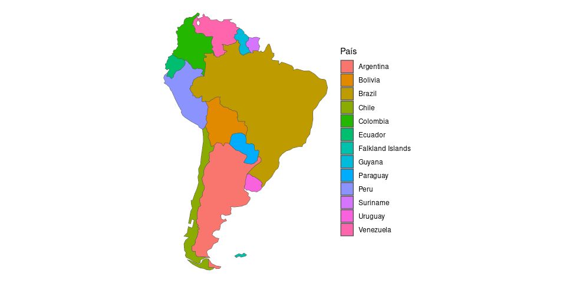

<!-- README.md is generated from README.Rmd. Please edit that file -->

# geoprocessamentor

<!-- badges: start -->

[](https://mybinder.org/v2/gh/FCopf/geoprocessamentor/master?urlpath=rstudio)
<!-- badges: end -->

Aqui você irá encontrar o material de apoio da UC de
**Geoprocessamento** para o $2^o$ semestre de 2023, oferecida ao
Bacharelado Interdisciplinar em Ciência e Tecnologia do Mar (BICT Mar) e
Engenharias, IMar, Unifesp, Campus Baixada Santista.

Abra a seção virtual do
<a href="https://www.rstudio.com/tags/rstudio-ide/" target="_blank">RStudio</a>
através do link  para rodar os arquivos `.R`,
`.Rmd` deste repositório.

## Cronograma

| Data         | Aula     | Conteúdo                                               | Entregas e atividades                                                   |
|--------------|----------|--------------------------------------------------------|-------------------------------------------------------------------------|
| **Agosto**   |          |                                                        |                                                                         |
| 16/08/23     | 1ª Aula  | Introdução e cronograma do curso                       |                                                                         |
| 23/08/23     | 2ª Aula  | Manipulação de atributos não espaciais em tabelas      |                                                                         |
| 30/08/23     | 3ª Aula  | Manipulação de atributos espaciais em tabelas          | *Entrega da lista Aula_02_exercicios*                                   |
| **Setembro** |          |                                                        |                                                                         |
| 06/09/23     | 4ª Aula  | Dados vetoriais, manipulações e transformações         | *Entrega da lista Aula_03_exercicios*                                   |
| 13/09/23     | 5ª Aula  | Dados matriciais do tipo raster                        | *Entrega da lista Aula_04_exercicios*; *Envio do tema do trabalho*      |
| 20/09/23     | 6ª Aula  | Operações e manipulações de dados raster               | *Entrega da lista Aula_05_exercicios*                                   |
| 27/09/23     | 7ª Aula  | Projeções                                              | *Entrega da lista Aula_06_exercicios*                                   |
| **Outubro**  |          |                                                        |                                                                         |
| 04/10/23     | 8ª Aula  | Bases de dados                                         | *Entrega da lista Aula_07_exercicios*                                   |
| 11/10/23     | 9ª Aula  | Atividade prática: busca de bases de dados do trabalho | *Entrega da lista Aula_08_exercicios*; *Envio da proposta trabalho*     |
| 18/10/23     | 10ª Aula | Atividade prática: processamento de dados do trabalho  |                                                                         |
| 25/10/23     | 11ª Aula | Atividade prática: processamento de dados do trabalho  |                                                                         |
| **Novembro** |          |                                                        |                                                                         |
| 01/11/23     | 12ª Aula | Interações entre dados vetoriais e raster              | *Envio da listagem das bases de dados que serão utilizadas no trabalho* |
| 08/11/23     | 13ª Aula | Interações entre dados vetoriais e raster              | *Entrega da lista Aula_12_exercicios*                                   |
| 15/11/23     | Feriado  | **NÃO HAVERÁ AULA**                                    |                                                                         |
| 22/11/23     | 14ª Aula | Confecção de mapas                                     | *Entrega da lista Aula_13_exercicios*                                   |
| 29/11/23     | 15ª Aula | Confecção de mapas                                     | *Entrega da lista Aula_14_exercicios*; *Envio da 1ª versão do trabalho* |
| **Dezembro** |          |                                                        |                                                                         |
| 06/12/23     | 16ª Aula | Atividade prática: correções, ajustes finais           | *Entrega da lista Aula_15_exercicios*; *Entrega do trabalho*            |
| 13/12/23     | 17ª Aula | Atividade prática: correções, ajustes finais           | *Entrega do trabalho*                                                   |
| 20/12/23     | Exame    | **PROVA EM SALA DE AULA**                              |                                                                         |

## Instruções

- **Envio do tema do trabalho** (10% da nota final): Enviado via
  **Moodle**, um documento contendo os integrantes do grupo (**RA, Nome
  completo**) e um parágrafo descrevendo os objetivos do trabalho. O
  trabalho final será composto por um ou mais **mapa(s) temático(s)**
  propostos para responder a uma ou mais perguntas objetivas. Descreva:
  o título do trabalho, qual(is) pergunta(s) pretendem ser respondida(s)
  e quais tipos de informações (espaciais e não espaciais) julgam ser
  necessárias para alcançar os objetivos.

- **Envio da proposta de trabalho** (10% da nota final): O grupo deverá
  descrever todas as bases de dados, onde pretendem encontrá-las e qual
  será a metodologia de trabalho para a geração do mapa temático, isto
  é, quais serão as operações necessárias para processar as bases de
  dados a fim de gerar o(s) mapa(s) temático(s).

- **Envio da listagem das bases de dados que serão utilizadas no
  trabalho** (10% da nota final): Cada grupo deverá enviar via Moodle
  uma lista contendo o nome e a descrição das bases de dados, bem como o
  local de onde serão obtidas (link web, pacote R, etc.).

- **Envio da 1ª versão do trabalho** (20% da nota final): Os grupos
  devem enviar via **Moodle** os scripts utilizados para gerar os mapas
  temáticos, contendo a descrição de cada etapa do script.

- **Entrega dos trabalhos** (30% da nota final): Dias utilizados para
  correções finais antes da entrega do trabalho via Moodle. O trabalho
  será composto por um texto apresentando o título, nomes dos
  integrantes, objetivos do trabalho e detalhamento do processo de
  geração do(s) mapa(s) por meio de scripts comentados. As imagens e
  tabelas temáticas finais devem estar em documentos separados nos
  formatos `.png` (imagens) e `.pdf` (tabelas) (ver documento:
  <a href="https://github.com/FCopf/geoprocessamentor/blob/master/Exemplo_trabalho_final.pdf" target="_blank">Exemplo_trabalho_final.pdf</a>).

- **Entrega da lista Aula_XX_exercicios** (20% da nota final): As listas
  de exercícios devem ser enviadas em formado `PDF` ou `Rmd` via
  **Moodle**. As listas ficarão abertas por uma semana. O envio via
  Moodle poderá ser feito da *4ª feira no dia da aula, desde o meio dia,
  até a 4ª feira seguinte, também ao meio dia*.

- **Observação**: A entrega das etapas do trabalho após as datas
  previstas contabilizará no **máximo 2/3 da nota para a etapa**. As
  listas de aula devem ser enviadas **exclusivamente** via Moodle, no
  período em que estarão abertas. Não serão contabilizados envios feitos
  por outro canal (Email, Whatsapp, etc.)

## Estrutura das pastas

- Na pastas **aulas_r** e **aulas_rmd** você encontrará as aulas nos
  formatos `.R` e `.Rmd` respectivamente contendo os tópicos e
  exercícios de cada aula. Você pode escolher seguir qualquer um dos
  formatos acompanhar as atividades.

- Na pasta **scripts** estão funções úteis que serão utilizadas durante
  o curso.

- Na pasta **dados** estão as bases de dados (`.csv`, `.shp`, `.gif`,
  etc…) utilizadas no curso.

- Na pasta **exercicios** estão as listas de execícios a serem entregues
  ao final de cada aula.

- Uma vez no ambiente  do
  <a href="https://www.rstudio.com/tags/rstudio-ide/" target="_blank">RStudio</a>,
  qualquer arquivo pode ser exportado a partir da aba **Files** –\>
  **More** 

## E-books e tutorais

- Programação em R

  1.  <a href="https://fcopf.github.io/probest-introR/" target="_blank">Introdução
      ao Ambiente R de Programação</a>

  2.  <a href="https://fcopf.github.io/visualizacao-de-dados/" target="_blank">Descrição
      e Visualização de Dados</a>

  3.  <a href="https://www.tidyverse.org/" target="_blank">Tidyverse</a>

- Geoprocessamento em R

  1.  <a href="https://r.geocompx.org/" target="_blank">Geocomputation
      with R</a>

  2.  <a href="https://geobgu.xyz/r/index.html" target="_blank">Introduction
      to Spatial Data Programming with R</a>

  3.  <a href="https://r-spatial.org/book/" target="_blank">Spatial Data
      Science: With Applications in R</a>

- Pacotes úteis em geoprocessamento

  1.  <a href="https://r-spatial.github.io/sf/" target="_blank">Simple
      Features for R</a>

  2.  <a href="https://rspatial.org/index.html" target="_blank">Spatial
      Data Science with R and “terra”</a>

  3.  <a href="https://r-spatial.github.io/stars/index.html" target="_blank">Spatiotemporal
      Arrays: Raster and Vector Datacubes</a>

## Exemplo

``` r
library(sf)
library(spData)
library(tidyverse)
```

Carregando os dados `world`.

``` r
data(world)
```

Verificando a tabela de atributos das 10 primeiras linhas.

``` r
world %>%
  head(n = 10)
#> Simple feature collection with 10 features and 10 fields
#> Geometry type: MULTIPOLYGON
#> Dimension:     XY
#> Bounding box:  xmin: -180 ymin: -55.25 xmax: 180 ymax: 83.23324
#> Geodetic CRS:  WGS 84
#> # A tibble: 10 × 11
#>    iso_a2 name_long continent region_un subregion type  area_km2     pop lifeExp
#>    <chr>  <chr>     <chr>     <chr>     <chr>     <chr>    <dbl>   <dbl>   <dbl>
#>  1 FJ     Fiji      Oceania   Oceania   Melanesia Sove…   1.93e4  8.86e5    70.0
#>  2 TZ     Tanzania  Africa    Africa    Eastern … Sove…   9.33e5  5.22e7    64.2
#>  3 EH     Western … Africa    Africa    Northern… Inde…   9.63e4 NA         NA  
#>  4 CA     Canada    North Am… Americas  Northern… Sove…   1.00e7  3.55e7    82.0
#>  5 US     United S… North Am… Americas  Northern… Coun…   9.51e6  3.19e8    78.8
#>  6 KZ     Kazakhst… Asia      Asia      Central … Sove…   2.73e6  1.73e7    71.6
#>  7 UZ     Uzbekist… Asia      Asia      Central … Sove…   4.61e5  3.08e7    71.0
#>  8 PG     Papua Ne… Oceania   Oceania   Melanesia Sove…   4.65e5  7.76e6    65.2
#>  9 ID     Indonesia Asia      Asia      South-Ea… Sove…   1.82e6  2.55e8    68.9
#> 10 AR     Argentina South Am… Americas  South Am… Sove…   2.78e6  4.30e7    76.3
#> # ℹ 2 more variables: gdpPercap <dbl>, geom <MULTIPOLYGON [°]>
```

Plotando o mapa de continentes.

``` r
ggplot(world) +
  geom_sf(aes(fill = continent))
```


Plotando o mapa de tamanhos populacionais.

``` r
ggplot(world) +
  geom_sf(aes(fill = pop))
```


Plotando o mapa da América do Sul.

``` r
asul <- world %>% 
  filter(continent == 'South America')

asul
#> Simple feature collection with 13 features and 10 fields
#> Geometry type: MULTIPOLYGON
#> Dimension:     XY
#> Bounding box:  xmin: -81.41094 ymin: -55.61183 xmax: -34.72999 ymax: 12.4373
#> Geodetic CRS:  WGS 84
#> # A tibble: 13 × 11
#>    iso_a2 name_long continent region_un subregion type  area_km2     pop lifeExp
#>  * <chr>  <chr>     <chr>     <chr>     <chr>     <chr>    <dbl>   <dbl>   <dbl>
#>  1 AR     Argentina South Am… Americas  South Am… Sove… 2784469.  4.30e7    76.3
#>  2 CL     Chile     South Am… Americas  South Am… Sove…  814844.  1.76e7    79.1
#>  3 FK     Falkland… South Am… Americas  South Am… Depe…   16364. NA         NA  
#>  4 UY     Uruguay   South Am… Americas  South Am… Sove…  176854.  3.42e6    77.2
#>  5 BR     Brazil    South Am… Americas  South Am… Sove… 8508557.  2.04e8    75.0
#>  6 BO     Bolivia   South Am… Americas  South Am… Sove… 1085270.  1.06e7    68.4
#>  7 PE     Peru      South Am… Americas  South Am… Sove… 1309700.  3.10e7    74.5
#>  8 CO     Colombia  South Am… Americas  South Am… Sove… 1151883.  4.78e7    74.0
#>  9 VE     Venezuela South Am… Americas  South Am… Sove…  908499.  3.07e7    74.2
#> 10 GY     Guyana    South Am… Americas  South Am… Sove…  209802.  7.63e5    66.4
#> 11 SR     Suriname  South Am… Americas  South Am… Sove…  144269.  5.48e5    71.1
#> 12 EC     Ecuador   South Am… Americas  South Am… Sove…  250747.  1.59e7    75.9
#> 13 PY     Paraguay  South Am… Americas  South Am… Sove…  401336.  6.55e6    72.9
#> # ℹ 2 more variables: gdpPercap <dbl>, geom <MULTIPOLYGON [°]>
```

``` r
ggplot(asul) +
  geom_sf(aes(fill = name_long)) +
  labs(fill = 'País') +
  theme_void()
```


